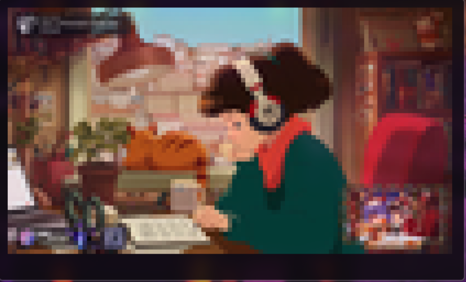

# GoFigirl TUI

A terminal user interface for playing YouTube streams, inspired by the Lofi Girl stream.

This application is written in Go and uses `yt-dlp` and `mpv` to play YouTube streams in the terminal.




## Features

-   Play predefined streams from a `presets.json` file.
-   Play any YouTube URL by pasting it into the input field.
-   Select video output style:
    -   **Lofi Video**: `tct` (terminal-based video)
    -   **HD Video**: `gpu` (normal video output)
-   Built with [Bubble Tea](https://github.com/charmbracelet/bubbletea).

## Prerequisites

-   [Go](https://golang.org/doc/install)
-   `yt-dlp` and `mpv` (see Dependencies section)

## Dependencies

You will need to have `yt-dlp` and `mpv` installed on your system.

### Arch Linux / Manjaro

```bash
sudo pacman -S yt-dlp mpv
```

### Debian / Ubuntu

```bash
sudo apt update
sudo apt install yt-dlp mpv
```

## Installation

1.  Clone the repository:
    ```bash
    git clone <repository-url>
    cd gofigirl-tui
    ```
2.  Run the installation script:
    ```bash
    ./install.sh
    ```
    The script will prompt you to choose an installation directory. It will then build the binary and copy it along with `presets.json` to your chosen location.

## Usage

-   To launch the TUI:
    ```bash
    gofigirl
    ```
-   To play a YouTube URL directly (defaulting to "Lofi Video" style):
    ```bash
    gofigirl https://youtu.be/cfuGO3sHXXo
    ```

## Controls
-   **Up/Down Arrows**: Navigate the preset list.
-   **Left/Right Arrows**: Change the video style.
-   **Enter**: Play the selected preset or the custom URL.
-   **q / ctrl+c**: Quit the application.


## `presets.json`

The `presets.json` file contains a list of presets that are displayed in the TUI. You can customize this file to add, remove, or modify the presets.

Each preset is a JSON object with a `name` and a `url` field:

```json
[
    {
        "name": "Lofi Girl",
        "url": "https://www.youtube.com/watch?v=jfKfPfyJRdk"
    },
    {
        "name": "Synthwave Lofi",
        "url": "https://www.youtube.com/watch?v=4xDzrJKXOOY"
    }
]
```
